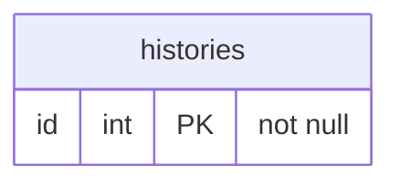
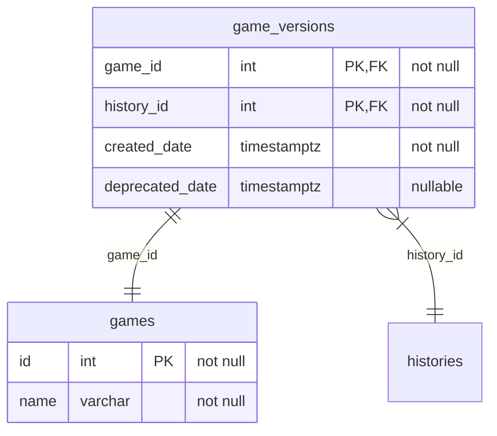
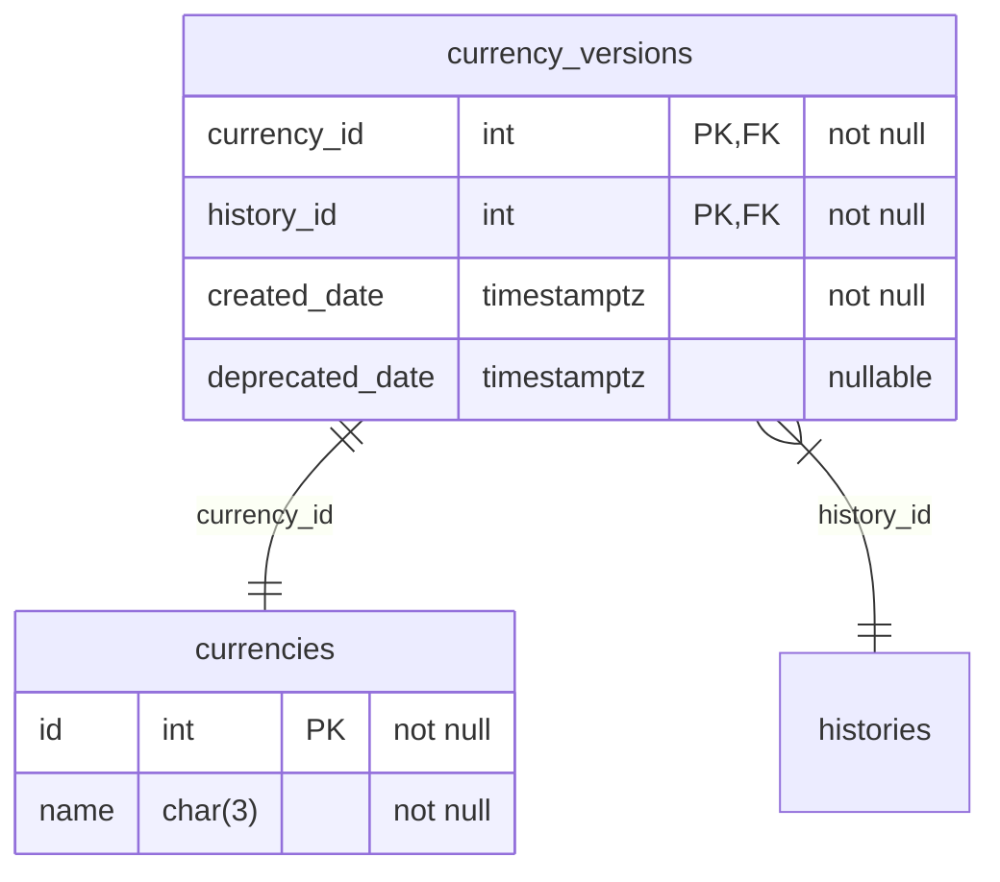
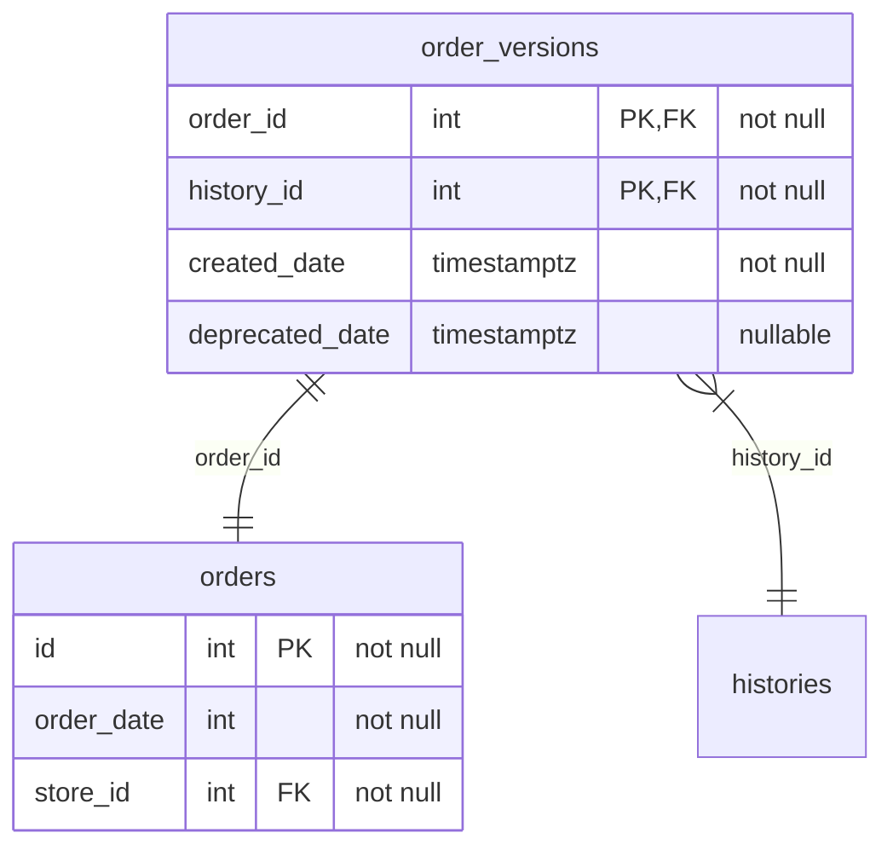
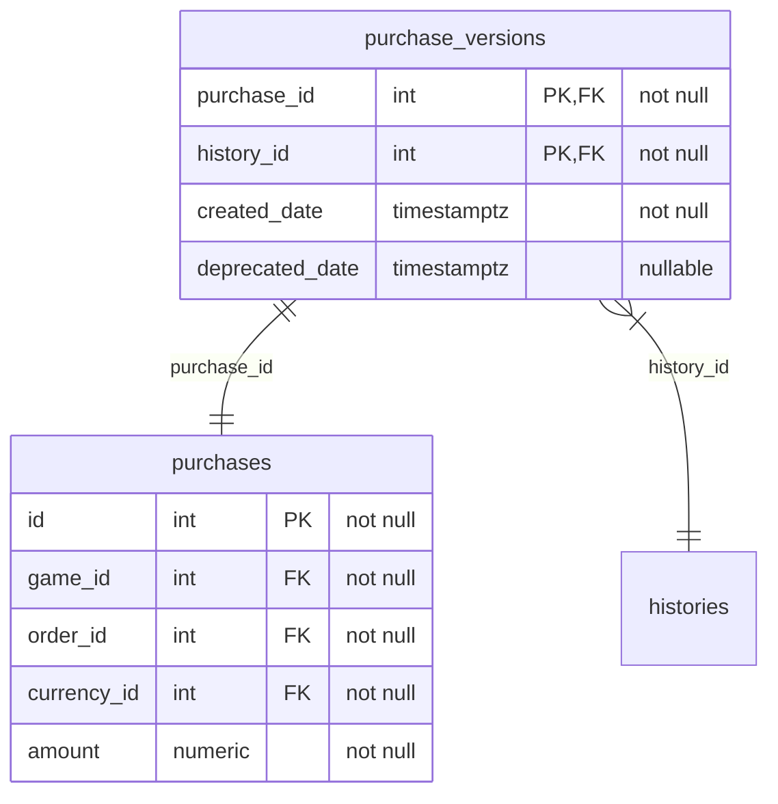

# Entities

## Table of Contents

[Histories](#histories) 
[Games](#games) 
[Stores](#stores) 
[Currencies](#currencies) 
[Orders](#orders) 
[Purchases](#purchases) 

## Histories

The `histories` table contains a single column for identifying a history.
Histories are used by all entities that track version information.
Per version series,
 one record in `histories` will be created.

All tables that use a version series have a table called `<entity>_versions` that stores information for a version of that entity.
Every record of such a versions table has a primary key that consists of the primary key of the associated entity and the primary key of the `histories` table.
Additionally,
 each record contains a `created_date` and an optional `deprecated_date`.

Each version series has one or zero entry where `deprecated_date` is `null`.
The time range between `created_date` and `deprecated_date` may not overlap for records that share the same `history_id`.

A version series can be selected by filtering the versions table by an `history_id` and optionally sorting it by `created_date`.

Some documentation chapters may refer to a version series as a single record,
 because the concept of versions is decoupled from the actual entities.
When an entity documentation mentions "one record per ...",
 it refers to one version series per other entity,
 or multiple records associated with the same history per other entity.

## Games

The `games` table contains data about a specific game.
Games owned in multiple stores are created as a single entity.
Currently,
 a game has only a `name`,
 but in the future it might have more data,
 such as an expected number of hours to complete or number of achievements.

## Stores

The `stores` table contains data about a specific store.
Currently,
 the store only has a `name`,
 but in the future there may be added more fields,
 such as how the rating of games in this store should be normalized.

## Currencies

The `currencies` table contains data about a specific currency that can be used in [orders](#orders).
The currency's name is a three character name,
 that should represent the short name of the currency,
 such as EUR, USD, or JPY.

## Orders

The `orders` table contains data about a specific order from a [store](#stores).
An order is considered a single checkout,
 that may contain one or more [purchased items](#purchases).

## Purchases

The `purchases` table contains data about a specific purchased item as part of an [order](#orders).
As such,
 purchased items can represent the same [game](#games) in different [stores](#stores).
For games that have been purchased in multiple stores,
 one record will be created per order that was placed containing this game.

