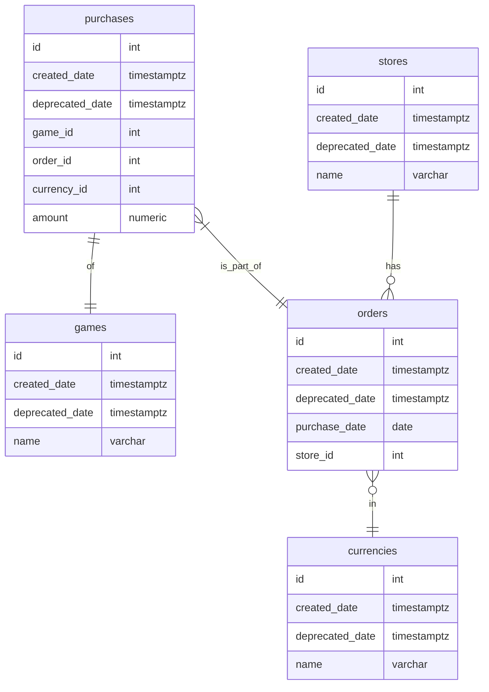

# Entities

```mermaid
erDiagram
    games {
        id int
        created_date timestamptz
        deprecated_date timestamptz
        name varchar
    }
    
    stores {
        id int
        created_date timestamptz
        deprecated_date timestamptz
        name varchar
    }

    currencies {
        id int
        created_date timestamptz
        deprecated_date timestamptz
        name varchar
    }
    
    orders {
        id int
        created_date timestamptz
        deprecated_date timestamptz
        purchase_date date
        store_id int
    }
    
    purchases {
        id int
        created_date timestamptz
        deprecated_date timestamptz
        game_id int
        order_id int
        currency_id int
        amount numeric
    }

    stores ||--o{ orders : has
    purchases ||--|| games : of
    purchases }|--|| orders : is_part_of
    orders }o--|| currencies : in
```